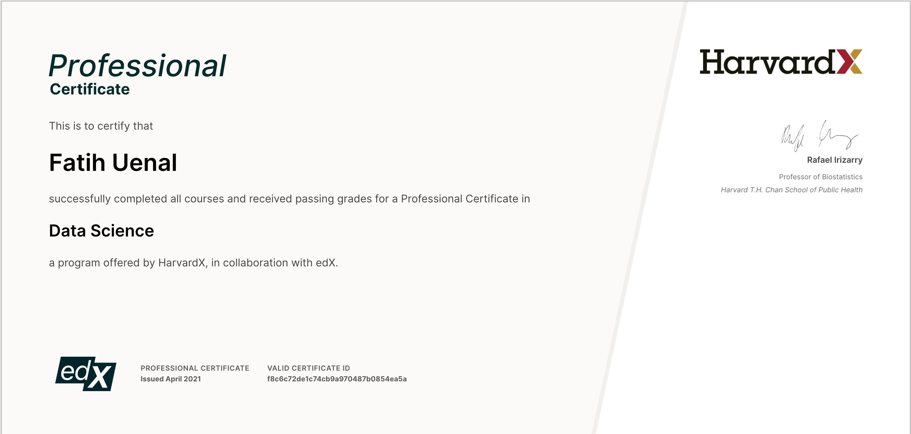
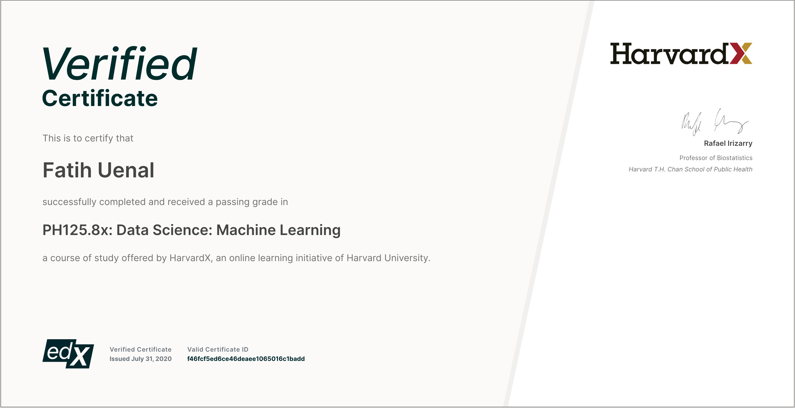
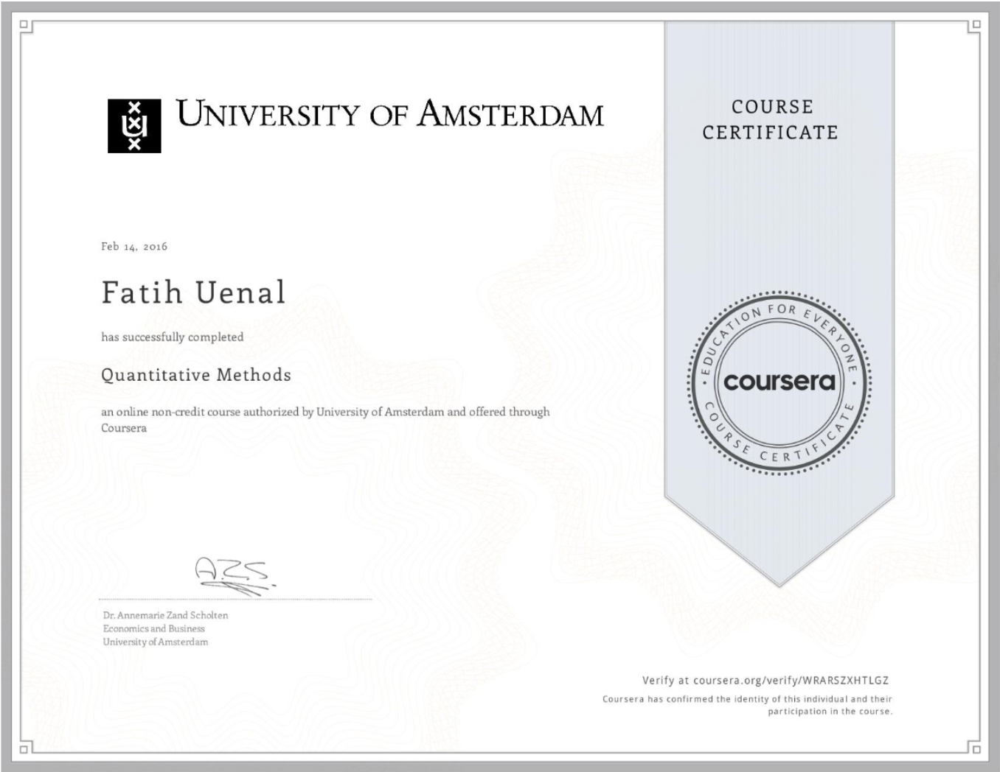

### Dr. Fatih Uenal || Social & Political Psychologist || Data Scientist
Last updated: `r Sys.Date()`


<a href="https://fuenal.github.io/dataism/Lectures.html"> 
```{r The Brain, out.width=150, echo=F}
knitr::include_graphics("images/The Brain.png")
```
</a>


---

Currently, I am working as a Postdoctoral Research Associate & Data Scientist at the [Cambridge Social Decision-Making Lab](https://www.sdmlab.psychol.cam.ac.uk/staff/dr-fatih-uenal) (University of Cambridge, UK). I am passionate about data-driven knowledge production  with a specific focus on phenomena such as climate change, environmentalism, Islamophobia, racism, sexism, and speciesism. I am analyzing these topics from social and evolutionary psychological perspectives. 

<div style="margin-bottom:30px;">
</div>

My research has been featured in the [Washington Post](https://www.washingtonpost.com/world/europe/at-a-site-of-nazi-terror-muslim-refugees-reckon-with-germanys-past/2017/08/10/12e2c864-779b-11e7-8c17-533c52b2f014_story.html), [Die Welt](https://www.welt.de/politik/deutschland/plus197864753/Juden-und-Muslime-Quelle-des-Antisemitismus-hat-sich-gewandelt.html), [Der Spiegel](https://www.spiegel.de/panorama/integration-in-welcher-generation-wird-man-den-migrationshintergrund-los-a-3970c589-6941-4ceb-8a3e-379fd0110afc), [Varsity](https://www.varsity.co.uk/news/20008), and other outlets.

<div style="margin-bottom:30px;">
</div>

If you are interested in my research, please visit 

 * [@Harvard](https://scholar.harvard.edu/fatih-uenal)
 
 * [@Cambridge](https://www.sdmlab.psychol.cam.ac.uk/staff/dr-fatih-uenal)
 
 * [ResearchGate Profile](https://www.researchgate.net/profile/Fatih_Uenal).

<div style="margin-bottom:30px;">
</div>

---

# Skills   

 
|                          |           |                   |
|--------------------------|----------:|------------------:|
| **Languages**            |           |          |
|                          |           |                   |
|                          |  German   |  Native Speaker   |
|                          |  Turkish  |  Native Speaker   |
|                          |  English  |  Proficient User  |
|                          |  Arabic   |  Basic User       |
|                          |  French   |  Basic User       |
|                          |           |                   |
| **Programming**          |           |                   |
|                          |  R        |  Advanced         |
|                          |  Python   |  Intermediate     |
|                          |  Docker   |  Intermediate     |
|                          |  SQL      |  Beginner         |
|                          |           |                   |
| **Statistical Software** |           |                   |
|                          |  SPSS     |  Advanced         |
|                          |  STATA    |  Intermediate     |
|                          |  AMOS     |  Intermediate     |
|                          |  G*Power  |  Intermediate     |
| **Data collection**      |           |                   |
|                          |           |                   |
|                          |  Qualtrics|  Advanced         |
|                          |  MTurk    |  Intermediate     |
|                          |  Prolific |  Intermediate     |
|                          |  G*Gorilla.sc  |  Intermediate     |

---

# Data Science

---

|                          |           |                   
|--------------------------|----------:|
| **Machine Learning**     |           |
|                          |           |  
|                          |  Supervised learning   | 
|                          |  Unsupervised learning   | 
|                          |  Reinforcement learning   | 
|                          |  Natural Language Processing  | 
|                          |  Artificial Neural Nets  |  
|                          |  K-means   | 
|                          |  Hierarchical cluster   | 
|                          |  Linear discriminant analysis   | 
|                          |  Quadratic discriminant analysis   | 
|                          |  Principal Components Analysis  | 
|                          |  Boosting   | 
|                          |  Bagging   | 
|                          |  Random forests   | 
|                          |  Support Vector Machine   | 
|                          |  Cross-validation   | 
|                          |           |                   
| **Statistics **          |  Probability         |  
|                          |  Bayesian Statistics        | 
|                          |  Univariate Analysis  |  
|                          |  Multivariate  Analysis       | 
|                          |  Time-series Analysis         | 
|                          |  Structural Equation Modeling         | 
|                          |  Confirmatory Factor Analysis         | 
|                          |  Psychometrics         | 
|                          |  A/B Testing         | 
|                          |  Experimental Survey Analysis         | 
|                          |  Population-Based Survey Analysis         | 
|                          |           |                   
| **Data Analsysis & Communication** |           | 
|                          |  Modeling     |  
|                          |  Hypothesis Testing         | 
|                          |  Wrangling         | 
|                          |  Data Visualization         | 
|                          |  Presentation         | 


<div style="margin-bottom:30px;">
</div>

---

# Certificates

**Harvard University: Data Science Professional Certificate**

<div style="margin-bottom:30px;">
</div>

<a href="https://www.edx.org/professional-certificate/harvardx-data-science?index=product&queryID=d0f4f7fc8dcee50272013dbcb56859b1&position=2">
```{r certificate, out.width=800, echo=F}

```
</a>

<div style="margin-bottom:30px;">
</div>

**Harvard University: Data Science - Machine Learning**

<div style="margin-bottom:30px;">
</div>

<a href="https://courses.edx.org/certificates/f46fcf5ed6ce46deaee1065016c1badd">
```{r certificate-1a, out.width=800, echo=F}

```
</a>

<div style="margin-bottom:30px;">
</div>


**University of Copenhagen: Measuring Causal Effects in the Social Sciences**


<div style="margin-bottom:30px;">
</div>

<a href="https://www.coursera.org/account/accomplishments/verify/2SNTCXJFY82P">
```{r certificate-1, out.width=800, echo=F}
knitr::include_graphics("images/causal_effects.png")
```
</a>

<div style="margin-bottom:30px;">
</div>

**University of Amsterdam: Quantitative Methods**

<div style="margin-bottom:30px;">
</div>

<a href="https://www.coursera.org/account/accomplishments/verify/WRARSZXHTLGZ">
```{r certificate-2, out.width=800, echo=F}

```
</a>

